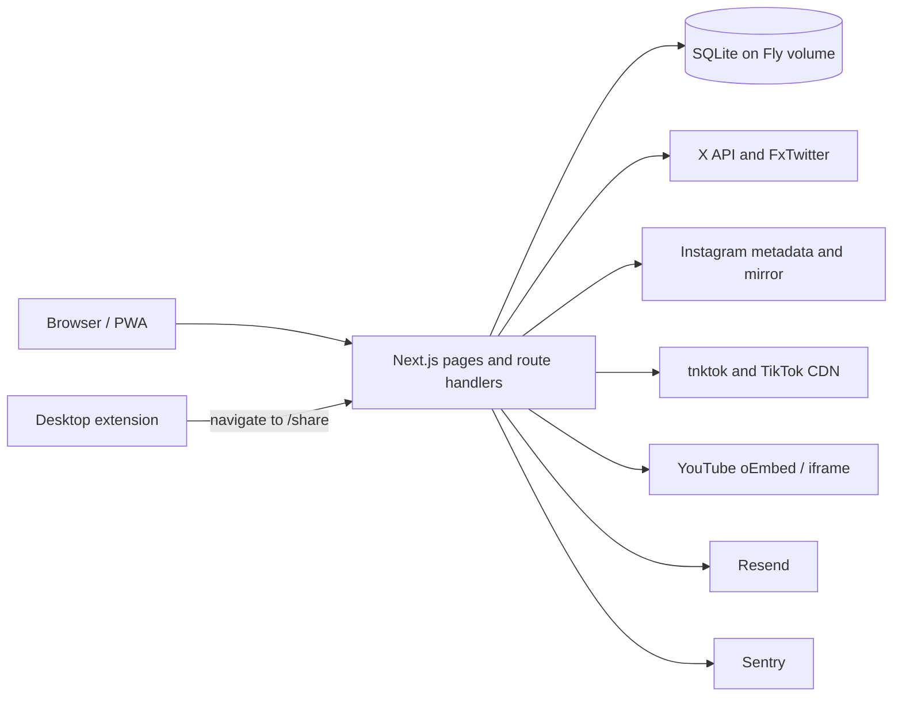
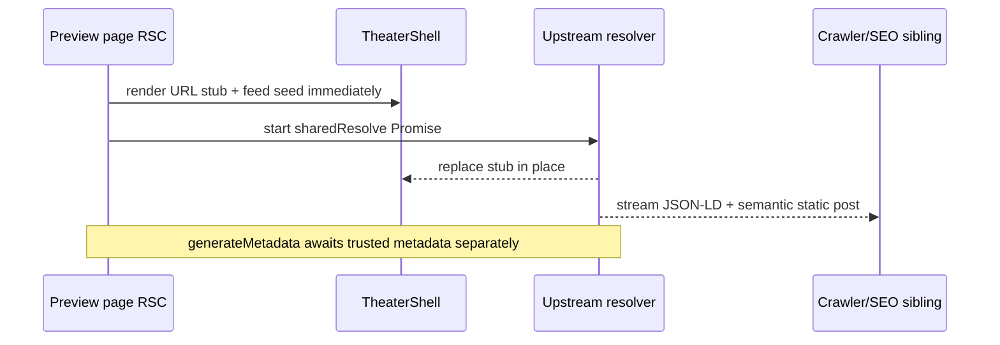
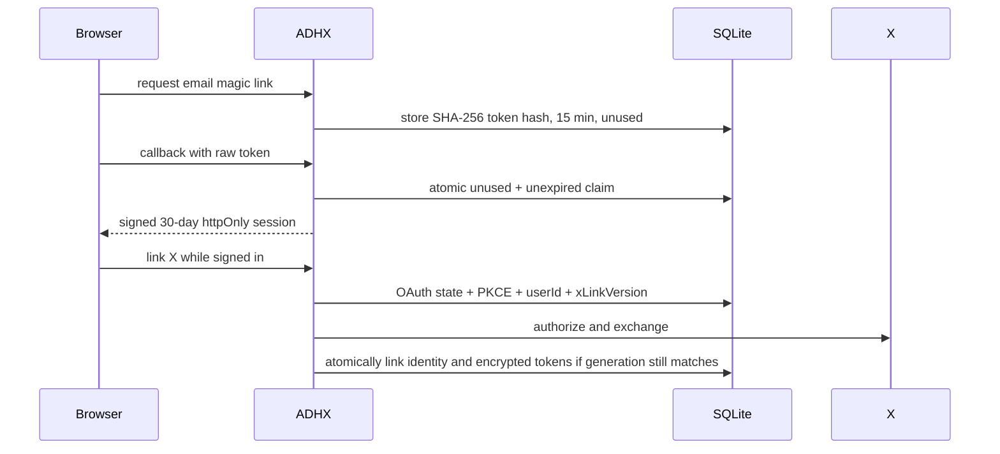

# Architecture

This is the human-facing technical tour of ADHX: the shape of the system, the
important state transitions, and the boundaries that keep it safe. It is
intended to be linked from the README. For route-by-route operational notes,
security recipes, migration history, and deployment commands, use
[`CLAUDE.md`](CLAUDE.md). Focused behavior lives in
[`docs/specs/theater-first.md`](docs/specs/theater-first.md),
[`docs/specs/discovery-leaderboards.md`](docs/specs/discovery-leaderboards.md),
and [`docs/specs/translation-safety.md`](docs/specs/translation-safety.md).

ADHX is one Next.js 16 App Router application running React 19 and a Node
runtime. The Next.js route handlers are the backend. They use Drizzle over one
`better-sqlite3` connection and a persistent SQLite file; there is no separate
API service, queue worker, Redis tier, or object store.

## System context



The product uses three terms deliberately:

- **Saved** is one user's pile of saved posts and the unread theater at
  `/saved`.
- **Library** is the grid at `/library` used to browse, search, filter, and
  tag Saved.
- A **playlist** is exactly one public tag, viewed as a looping theater at
  `/t/{username}/{tag}`. Database and API names that predate this terminology
  may still say “collection.”

Archive is private removal from the active Saved queue. It is not a public
activity signal and does not delete the bookmark.

The visible timestamp answers a different question on each surface:

| Surface         | Timestamp                                                              |
| --------------- | ---------------------------------------------------------------------- |
| Live / Trending | When the post first entered ADHX through any saver or public activity. |
| Saved / Library | When this user saved it (`bookmarks.processed_at`).                    |
| Playlist        | When the curator added it to that tag (`bookmark_tags.created_at`).    |

## Product routes

| Route                       | Role                                                                                                      |
| --------------------------- | --------------------------------------------------------------------------------------------------------- |
| `/`                         | Signed-out public Live theater plus crawlable static content. A signed-in request redirects to `/live`.   |
| `/live`                     | Signed-in community Live theater. Signed-out requests return to `/`.                                      |
| `/saved`                    | Signed-in unseen Saved queue. Library links can select a post with `?open=`.                              |
| `/library`                  | Signed-in grid over Saved: search, platform/type/tag filters, archived view, and grid/list/bento layouts. |
| `/{user}/status/{id}`       | X post preview.                                                                                           |
| `/reel/{id}`, `/reels/{id}` | Equivalent Instagram Reel preview routes.                                                                 |
| `/@{user}/video/{id}`       | TikTok video preview.                                                                                     |
| `/shorts/{id}`              | YouTube Shorts preview; regular YouTube videos are intentionally unsupported.                             |
| `/trending`                 | Public dark ranked list with the Latest membership lens initially selected.                               |
| `/trending/{filter}`        | Crawlable `popular`, `videos`, `photos`, `text`, or `articles` lens.                                      |
| `/trending/archive`         | Index of permanent ISO-week snapshots.                                                                    |
| `/trending/archive/{week}`  | Frozen weekly ranked snapshot, capped to 50 posts.                                                        |
| `/leaderboard`              | Public playlist leaderboard for this week.                                                                |
| `/leaderboard/{window}`     | `today`, `month`, or `all-time` playlist ranking.                                                         |
| `/tags`                     | Signed-in playlist/tag management and sharing controls.                                                   |
| `/settings`                 | Account, reading, appearance, X connection, install, and deletion settings.                               |
| `/admin`                    | Persisted-admin-only analytics and moderation console.                                                    |
| `/share`                    | PWA/extension/share-sheet URL router; it does not store content itself.                                   |
| `/welcome`                  | One-shot, noindex username choice after a new email account is created.                                   |
| `/t/{username}`             | Public curator hub containing that account's public playlists.                                            |
| `/t/{username}/{tag}`       | Public playlist theater, cloneable as “Save playlist.”                                                    |
| `/{username}`               | Public X-author hub built from posts ADHX already knows publicly.                                         |

Legacy routes stay as redirects: `/collection` → `/saved`, `/discover` →
`/trending`, `/collections` → `/leaderboard`, and `/trending/play` → `/live`.
Username aliases permanently redirect old curator and playlist URLs after a
rename.

The five source preview shapes are first-class public pages, not modals:

| Source URL                      | ADHX URL                      |
| ------------------------------- | ----------------------------- |
| `x.com/{user}/status/{id}`      | `adhx.com/{user}/status/{id}` |
| `instagram.com/reel(s)/{id}`    | `adhx.com/reels/{id}`         |
| `tiktok.com/@{user}/video/{id}` | `adhx.com/@{user}/video/{id}` |
| `youtube.com/shorts/{id}`       | `adhx.com/shorts/{id}`        |

`src/proxy.ts` also recognizes a complete source URL pasted after
`adhx.com/` and issues a 307 to the clean route. TikTok short links go through
the bounded server resolver because their path does not contain the video ID.

## Save ingress and read flow

```mermaid
flowchart TD
  U[URL prefix / paste / share target / extension] --> P[Shared preview theater]
  P -->|new signed-in open| A[Autosave lead]
  P -->|explicit Save| ADD[/api/bookmarks/add]
  A --> ADD
  IP[Paste inside Live or Saved] --> ADD
  XS[X bookmark sync] --> SSE[/api/sync SSE]
  ADD --> DB[(bookmarks + media + links)]
  SSE --> DB
  DB --> F[/api/feed: Library and Saved]
  DB --> L[Live / Trending / playlist seeds]
```

`POST /api/bookmarks/add` is the platform-neutral save boundary. X delegates
over loopback to `/api/tweets/add` for article, quote, media, and link
enrichment. Instagram, TikTok, and YouTube use their own metadata adapters but
write the same bookmark/media model.

A signed-in **new open** of a preview autosaves its lead. “New open” means a
URL-prefix navigation, paste/share intent, extension navigation, or explicit
`?save=1` return after sign-in. Reload, back/forward, and an in-app hop such as
Trending → preview do not autosave. This distinction is based on navigation
type, document path, and a one-shot `sessionStorage` intent; an in-session key
claim prevents React Strict Mode from posting twice.

Pasting a supported URL while signed in on `/live` or `/saved` saves without
leaving the theater. A same-tab paste takes the stage immediately and pins the
interrupted post as Next. An add from another tab prepends in LIFO order
without stealing the current stage. If a type lens would hide the arrival, the
lens resets to All. Collection mutations notify the header, library, tags, and
other theaters through scoped window events and a `BroadcastChannel`.
Each envelope carries the immutable ADHX account ID. A tab ignores events while
authentication is unresolved or when the account does not match; account
changes invalidate and retry the auth snapshot before events resume. This stops
a stale signed-in tab from applying another account's saves or tags.

Sync is the second ingress. It imports the user's X bookmarks, but it is not
required for manually saving or viewing any supported platform.

## The theater runtime

`TheaterShell` is the orchestrator shared by four modes:

| Mode       | Feed and end behavior                                                                          |
| ---------- | ---------------------------------------------------------------------------------------------- |
| `home`     | Signed-out Live feed from the anonymous activity query.                                        |
| `shared`   | Opened preview pinned as the lead, followed by Live items.                                     |
| `personal` | Signed-in Live or Saved route. Repeat-off plays unseen items and stops at caught-up/all-clear. |
| `playlist` | One public tag ordered by curator-add time and looping at the boundary.                        |

Live and Saved are LIFO playlists ordered by the time a post entered that
surface, not by source publication time. Repeat off shows Now playing, Next,
and Seen; repeat all loops the selected list; repeat one loops the current
post. Queue type lenses are persisted. Playlist theaters omit the personal
type controls and always loop.

Shared previews optimize first paint without sacrificing crawler output:



An unresolved X source becomes a timed “unavailable” stage and noindex
metadata; an admin-hidden source uses a different “removed from ADHX” tombstone.
Thin non-X results remain playable as a URL-derived stage but are not
indexable unless trusted upstream or saved-local metadata resolved. The opened
shared lead gets one landing-only playable exemption even if it was previously
seen; every departure path releases it.

Seen state is browser-local to avoid per-user server cost. Immutable V2
operations form per-post last-writer-wins registers and converge through
`storage` events. The readable `adhx-seen-v1` array is only a compatibility
projection. Compaction keeps the newest 500 marks and 500 tombstones; bulk
Re-watch writes one batch. `adhx-last-visit` is recorded only when a page hides
or unloads.

One persistent `<video>` slot is retained across X, TikTok, ready Instagram
MP4s, and intervening non-video stages. Mobile browsers grant audible autoplay
to the element the user touched, so remounting per item would lose sound.
Source generations and lifecycle guards prevent a stale `play()` result,
`ended`, `error`, or `pause` from mutating the replacement clip. YouTube is an
iframe and therefore outside this native-video continuity.

Theater navigation, actions, queue overlays, album controls, Read/Watch mode,
and keyboard shortcuts are detailed in the
[theater-first specification](docs/specs/theater-first.md).

## Accounts and authentication

Email is the account and sign-in source of truth. X is an optional linked
identity used to sync bookmarks; it never creates a session or account.
`GET /api/auth/me` is the client-side source of truth for the account,
identities, X connection, username state, and persisted admin role.



Magic-link tokens are single-use, store only a hash, expire after 15 minutes,
and are rate-limited per normalized email. Email identity creation and email
changes claim the unique identity in a transaction so concurrent callbacks
have one winner. `/welcome` only accepts a live, unbanned, signed-in account
that has not already chosen a username.

The `adhx_session` cookie is an HS256 JWT with a 30-day expiry, `httpOnly`,
`sameSite=lax`, and `secure` in production. A valid signature is not sufficient
authorization: `getCurrentUserId()` also requires a live `users` row and a
successful, negative ban lookup. A deleted-account JWT or an unavailable
moderation store is treated as signed out.

X OAuth uses PKCE. Each `oauth_state` row is bound to the initiating ADHX
`userId`, has a 10-minute lifetime, captures the account's monotonic
`xLinkVersion`, and is consumed by an owner-and-expiry-conditional delete. A
callback under another session cannot consume it. Disconnect increments the
generation and removes the identity, tokens, and pending states atomically, so
an in-flight callback cannot reconnect behind the user's back. One partial
unique index permits at most one X identity per ADHX account.

OAuth access and refresh tokens are AES-256-GCM encrypted at rest. X refresh
tokens rotate and are single-use, so `getValidTokens()` is the only refresh
entry point:

- a five-minute expiry buffer refreshes before the edge;
- one in-process Promise coalesces same-user requests;
- a 30-second durable SQLite lease prevents another worker spending the same
  token;
- encrypted access/refresh columns, lease ID, linked identity, and generation
  form compare-and-swap guards;
- transient/network/5xx or stale-writer failures retain the current row;
- a fatal 400/401 deletes only the exact leased row X rejected, leaving the
  ADHX session intact.

Account deletion is one transaction. It removes user-owned content,
identities, OAuth material, preferences, tags, aliases, and owner-keyed
playlist statistics; nullable actor IDs in retained activity/analytics history
are anonymized. SQLite triggers reject every future insert or account-ID
change that references the deleted `users.id`, closing the race between an
already-authenticated request and deletion commit.

## Persistence planes

The schema is in `src/lib/db/schema.ts`. Tables are easier to understand by
plane than as one long list.

| Plane               | Tables                                                                             | Purpose                                                                                              |
| ------------------- | ---------------------------------------------------------------------------------- | ---------------------------------------------------------------------------------------------------- |
| Account             | `users`, `user_identities`, `username_aliases`, `login_tokens`                     | Immutable account identity, email/X links, durable rename redirects, one-time sign-in/change tokens. |
| X connection        | `oauth_state`, `oauth_tokens`                                                      | Bound PKCE state and encrypted rotating credentials with refresh lease.                              |
| User content        | `bookmarks`, `bookmark_media`, `bookmark_links`, `bookmark_tags`, `archived_posts` | Saved posts, media, rich links/articles, tags, and private archive state.                            |
| User settings       | `user_preferences`, `tag_shares`                                                   | Reading/theme preferences and public playlist visibility.                                            |
| Sync                | `sync_logs`                                                                        | Durable claim, heartbeat, outcome, and counts.                                                       |
| Public discovery    | `activity`                                                                         | Anonymous post-level preview/save/share pulse.                                                       |
| Private measurement | `analytics_events`                                                                 | Allowlisted product/growth events not suitable for the public pulse.                                 |
| Playlist ranking    | `collection_events`, `collection_aggregates`                                       | Retained view/clone detail and viewer-free all-time totals.                                          |
| Moderation          | `moderated_posts`, `user_bans`, `admin_audit`                                      | Post tombstones, account bans, and immutable-ID admin actions.                                       |

The main isolation key is `(userId, platform, sourceId)`. `bookmarks` uses
`(userId, platform, id)`; media, tags, links, and archive rows carry the same
owner/platform identity. This lets two users save the same post independently
and prevents a numeric TikTok ID colliding with a tweet ID. Every user-data
query must filter by `userId`; every bookmark-child lookup must also filter by
`platform`. Multi-table mutations use `runInTransaction()` and synchronous
`.run()` calls inside the `better-sqlite3` transaction.

`bookmark_links` has a unique
`(userId, platform, bookmarkId, expandedUrl)` boundary. Manual save and sync
both use field-wise upserts: null/sparse enrichment cannot erase an existing
article body, image, title, or description, and concurrent complementary
writes converge on a deterministic richer value.

SQLite runs in WAL mode with foreign keys enabled. Container startup runs
migrations before the server listens and stops on a failed security- or
integrity-critical step. Local development does not migrate automatically;
run `pnpm db:migrate` before `pnpm dev`.

## X bookmark sync

`GET /api/sync` is an authenticated SSE stream. Before opening it, the route
checks the configurable cooldown (one hour by default), confirms X credentials,
and atomically claims a `sync_logs.status = 'running'` row. A partial unique
index permits one running sync per user across processes.

The stream renews `heartbeat_at` and emits an SSE ping every 10 seconds. A
claim with no heartbeat for 30 minutes is reaped as failed. Completion and
failure updates include `(userId, syncId, status='running')`, so a stale worker
cannot overwrite a reaper or replacement owner. Loss of lease stops processing;
client disconnect marks the owned run failed.

Incremental sync fetches 50 bookmarks. Full sync pages up to 100 at a time and
clamps callers to 20 pages. The bookmark insert result—not a stale preloaded ID
set—is authoritative for “new” counts, analytics, client events, and public
pulses. At most the freshest 25 new rows from one sync enter the public pulse,
so a first-time backfill cannot flood Live.

## Discovery and measurement planes

These are intentionally separate logs with different privacy contracts.

### Public post activity

`recordActivity()` appends server-resolved `preview`, `save`, and `share`
signals to `activity`. Public clients may submit identifiers only; display
text, authors, images, type, and URLs are resolved or copied from trusted
server state. `userId` may be stored for abuse controls but is never selected
by a public read.

`getTrendingItems()` is the publication choke point used by `/`,
`/trending`, `/api/activity`, and `/api/trending`. It explicitly shapes public
columns, enriches saved posts, removes hidden/banned sources, and deduplicates
to one row per `platform:bookmarkId`. Live uses a 24-hour window and newest
ADHX arrival order; the Trending page ranks by interaction count with recency
as a tie-break. Bots and unfurl crawlers do not write preview pulses. Archive
never writes one.

### Private product analytics

`analytics_events` records allowlisted dimensions for post view/save/share,
send/copy/open/tag/archive, auth, sync, shortcut, theater, and playlist events.
Free-form client display data is not accepted. Post events require a canonical
platform and ID, and their content type is server-resolved. Public aggregate
rollups never select `userId`; the admin console reads the same query layer.
Rows older than 90 days are pruned during startup migration. Writes are
best-effort so measurement failure cannot fail the user action.

### Playlist leaderboard

`collection_events` records public-playlist `view` and `clone` events. Self
events do not count; signed-in viewers dedupe for 30 minutes and anonymous
views for 60 seconds. `viewerId` is write-only private data and is never
selected by `src/lib/discovery/rank.ts`.

The score is `views + 5 × clones`. Finite windows read 90 days of retained raw
detail. `collection_aggregates` is updated atomically with every accepted event
and preserves all-time totals without viewer identifiers or an unbounded event
scan. A playlist made private immediately becomes ineligible at read time.
Raw events older than 90 days are pruned at startup and by an hourly,
process-local maintenance pass outside the event-write transaction.
See the [leaderboard specification](docs/specs/discovery-leaderboards.md).

## Moderation fails closed

Moderation reads return either a typed successful result or “store
unavailable”; unavailable is never translated to visible/not-banned. The same
rule applies on cached and uncached paths.

- Hidden posts are tombstoned and noindexed on preview pages, omitted from
  Live, Trending, author hubs, playlists, APIs, and sitemap output, while
  remaining in owners' private libraries.
- Banned accounts lose authenticated access and are withheld from curator
  hubs, playlists, leaderboards, sitemap entries, and sign-in completion.
- Playlist hiding updates raw ranking detail and durable aggregates.
- Post hide/unhide updates `moderated_posts`, matching `activity.hidden`, and
  `admin_audit` in one transaction.
- Public cache hits re-read moderation and compare a moderation fingerprint
  before serving. Failures are non-cacheable.

Admin authorization is `users.role = 'admin'` on immutable account IDs, never
a runtime username allowlist. Startup verifies required moderation storage and
terminates if it cannot enforce this boundary.

## Media and outbound-network boundaries

Playback adapters reflect what each platform safely exposes:

| Platform       | Metadata                                            | Playback/download                                                                                  |
| -------------- | --------------------------------------------------- | -------------------------------------------------------------------------------------------------- |
| X              | FxTwitter; X API only for the owner's bookmark sync | Range-aware MP4/image proxy over allowlisted `twimg.com`; HLS routes remain for long streams.      |
| Instagram      | Saved data or Instagram OG metadata                 | vxinstagram-style mirror, Range-probed before attaching `src`; official Instagram iframe fallback. |
| TikTok         | tnktok/fxTikTok metadata                            | Proxy follows the mirror's signed redirect to allowlisted TikTok CDN hosts.                        |
| YouTube Shorts | Official oEmbed                                     | Privacy-enhanced `youtube-nocookie.com` iframe. No MP4 extraction or download.                     |

User-controlled media parameters are validated before interpolation. Media
URLs require HTTPS and exact hosts or dot-prefixed suffix matches—never
substring matching. Redirects are followed manually, every hop is rebuilt and
revalidated, and chains are capped. Arbitrary external OG enrichment uses
public-IP validation and connection-time DNS pinning across redirects to block
DNS rebinding and private-network access.

External work cannot occupy the single process indefinitely. Requests have
deadlines; retrying resolvers share an overall budget; redirects and parsed
bodies have hard limits; and chunked responses are counted as they stream.
Pass-through MP4 responses preserve Range semantics instead of buffering the
file in memory. Inline previews, attachment downloads, public reads, and
analytics writes use separate rate budgets. Exact limits are documented in
[`CLAUDE.md`](CLAUDE.md).

## Bounded in-process state and scaling envelope

The current deployment deliberately runs one Fly machine and one mounted
SQLite volume per environment. This makes process-local burst controls
accurate and keeps SQLite ownership simple.

Rate limiters have bounded IP buckets and fail closed for unseen keys when
capacity is full. Hot-query, media, and negative-result caches are TTL/LRU
bounded rather than raw maps. Positive public cache hits still recheck
moderation before serving.

Scaling to multiple application machines would require, at minimum, a shared
rate-limit store and an explicit database/volume strategy. The OAuth refresh
lease and sync claim already use durable SQLite rows and remain cross-process
safe, but process-local caches and browser-facing freshness are optimizations,
not distributed coherence mechanisms.

## Error reporting and privacy

Sentry is server-side only and enabled in production when a DSN is configured.
Releases and environments are tagged; traces are sampled at 20%.
`sendDefaultPii` is disabled.

Both explicit captures and SDK-generated events pass through bounded
sanitizers. Secrets, cookies, authorization data, query strings, request
headers, tokens, PKCE material, and email addresses are removed. User/account/
viewer IDs, usernames, and IP-like identifiers are HMAC-pseudonymized with a
deployment secret. URLs lose query strings, strings are capped, and recursive
contexts have depth/entry/node ceilings. Analytics metrics carry allowlisted
dimensions rather than raw user IDs.

## Extension and PWA

The Manifest V3 desktop extension is a navigation adapter, not another client
of the API. Toolbar, context-menu, and keyboard actions read the selected or
active supported URL and navigate the tab to `/share?url=…`. It has
`activeTab` and `contextMenus`, no `<all_urls>`, no content scripts, no token
storage, and no passive browsing collection. Chromium and Firefox artifacts
are built and manifest-validated in CI.

The web manifest registers `/share` as a GET Web Share Target and captures
`url`, `text`, and `title` because native apps disagree about where they put a
link. `/share` extracts the first supported URL, marks share intent, and routes
to the same preview pages; TikTok short links use a hard navigation through
the server resolver. The service worker exists only to satisfy installability:
its fetch handler never calls `respondWith`, so it provides no offline cache
and cannot serve stale application data.

iOS uses a Share Sheet shortcut because Safari does not support Web Share
Target. Android uses the installed PWA. All ingress paths converge on preview
and `/api/bookmarks/add`.

## Rendering, SEO, and runtime SQLite

Public pages combine visual UI with semantic server output: preview metadata,
JSON-LD (`SocialMediaPosting` or `VideoObject`), public tweet JSON, author and
curator hubs, Trending/playlist `CollectionPage` lists, and a dynamic sitemap.
Public APIs and preview metadata recheck moderation and avoid caching a
transient upstream miss as a durable publication decision.

The SQLite file is migrated only when the container starts. It is absent or
table-less during `next build`, so every DB-reading public surface must remain
runtime-rendered: `/`, `/live`, `/saved`, preview pages, `/trending` and its
archive/filter routes, `/leaderboard`, curator/author hubs, `/admin`, and
`/sitemap.xml` use `force-dynamic` where Next could otherwise prerender them.
Do not add `generateStaticParams` or convert these pages to static generation;
doing so either fails the build or bakes empty database output into HTML.

Browser translation remains enabled. React trees must follow the sibling text
node rule in the [translation-safety specification](docs/specs/translation-safety.md)
to avoid DOM ownership crashes after a translator inserts wrappers.

## Build, CI, and deployment

The Docker image uses the repository-pinned package manager and frozen
lockfile, produces Next's standalone output, and runs as a non-root user.
Container startup migrates SQLite before starting the application.

CI checks source quality, unit and browser behavior, the production build, both
extension targets, and the runnable container (including migrations and the
health endpoint).

Staging and production are separate Fly applications with separate volumes,
secrets, deploy credentials, Sentry environments, and health checks. Release
automation deploys to staging; production remains an explicit action.

For exact environment variables, migration recovery, deploy commands, and
incident procedures, see [`CLAUDE.md`](CLAUDE.md).
