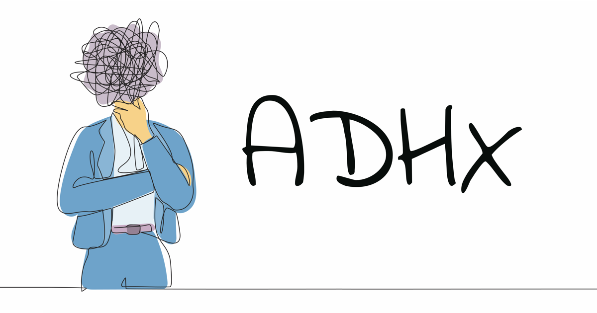
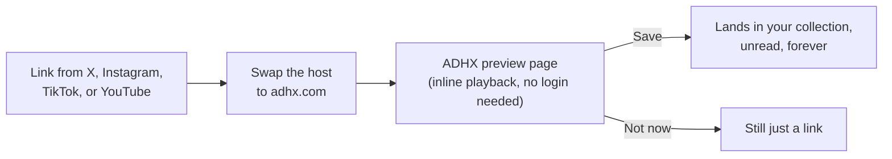

# ADHX

[](https://github.com/itsmemeworks/adhx/actions/workflows/ci.yml)
[](https://github.com/itsmemeworks/adhx/actions/workflows/release-please.yml)
[](https://opensource.org/licenses/MIT)
[](CONTRIBUTING.md)
[](https://github.com/itsmemeworks/adhx/stargazers)

> **Save now. Read never. Find always.**

For people who bookmark everything and read nothing. ADHX is the only open-source, self-hostable bookmark manager for X/Twitter — and, as far as we've been able to tell, the only bookmark manager on the internet that also saves and previews Instagram Reels, TikToks, and YouTube Shorts in one place. Sync your X bookmarks, drop in links from anywhere, and — should the moment ever come — actually find the thing you saved six months ago.

<p align="center">
  
  
</p>

<!-- TODO: hero GIF — capture the Matter UI: save flow + triage mode -->
<p align="center">
  
</p>

<p align="center">
  <i>Built for people who save tweets about productivity while procrastinating.</i>
</p>

---

## Why ADHX

Every other X/Twitter bookmark tool — Dewey, Tweetsmash, Twillot, take your pick — is closed-source SaaS: $10–20/mo, your bookmarks living on someone else's server, and search or export usually locked behind the tier above yours. That's a strange price to pay for a pile of stuff you were never going to read anyway.

ADHX takes the opposite approach:

- **Actually open source (MIT).** Read the code, audit it, fork it, argue with us in the issues. There's no subscription tier to hide anything behind.
- **Self-hostable, obviously.** Run it on your own Fly.io app, your own Docker host, or a laptop that's seen better days. Your data lives in a SQLite file you own, not a vendor's database.
- **No per-seat cost, because there's no seat.** You pay for your own compute, if any. There is no invoice, and there never will be.
- **Four platforms, one collection you'll still ignore.** X/Twitter bookmarks, Instagram Reels, TikToks, and YouTube Shorts land in the same searchable, mostly-unread feed. No other tool in this space covers all four.

---

## Feature tour

### Quick add: URL prefix

The fastest way in: replace the host in any link with `adhx.com`. That's the whole trick.



```
x.com/user/status/123        instagram.com/reels/abc      tiktok.com/@user/video/123     youtube.com/shorts/abc
  ↓                            ↓                             ↓                              ↓
adhx.com/user/status/123     adhx.com/reels/abc            adhx.com/@user/video/123       adhx.com/shorts/abc
```

You can also paste the full URL after `adhx.com/` — the middleware proxy (`src/proxy.ts`) handles every shape:

```
adhx.com/https://x.com/user/status/123              → /user/status/123
adhx.com/https://www.instagram.com/reels/abc        → /reels/abc
adhx.com/https://www.tiktok.com/@user/video/123     → /@user/video/123
adhx.com/https://youtube.com/shorts/abc             → /shorts/abc   (also youtu.be/abc, watch?v=abc)
```

Tweets land in your collection and open in the lightbox. Reels and TikToks render a public preview with inline playback that you can save alongside your tweets. YouTube Shorts play inline via the official embed. None of it requires you to have actually watched anything.

### Save it from anywhere

Pick whatever's least friction for your device — every route ends up at the same `adhx.com` preview:

| Method                  | Best for          | How                                                                                                    |
| ----------------------- | ----------------- | ------------------------------------------------------------------------------------------------------ |
| **URL-prefix trick**    | Everyone          | Replace the link's host with `adhx.com`. Works on any device, no setup.                                |
| **Bookmarklet**         | Desktop + Android | Drag the one-click bookmarklet to your toolbar; click it on any X / Instagram / TikTok / YouTube page. |
| **Add to ADHX**         | Logged-in users   | Paste any link into the in-app "Add" box — platform auto-detected.                                     |
| **Android share sheet** | Android           | Install ADHX as a PWA, then Share → ADHX from any app.                                                 |
| **iOS Shortcut**        | iOS               | One-tap Share Sheet shortcut (currently X-only; use the URL-prefix trick for the other platforms).     |

Install ADHX as a Progressive Web App and it runs full-screen from your home screen, remembers your session, and (on Android) registers as a share target — so the bookmark can find you, since you clearly weren't going back for it.

### Triage mode

A full-screen, one-card-at-a-time pass through your backlog: Keep / Delete / Done with arrow keys, plus a daily streak so the backlog actually shrinks instead of just growing a matching counter of shame.

### Public trending

[`/trending`](https://adhx.com/trending) is a live, anonymous feed of what the ADHX community is saving and previewing right now, with per-type hubs (videos, photos, text, articles) and a weekly archive. No account needed to browse it — everyone's business but nobody's name.

### Tag sharing

Tag your collection, then publish any tag as a friendly public URL (`/t/{username}/{tag}`) that anyone can browse — and that other ADHX users can clone straight into their own, equally unread collection.

### LLM-friendly by design

Turns out AI agents want to read your saved posts as badly as you don't. ADHX exposes structured data for them too, not just humans:

- A public [JSON API](#api) for any saved post (author, engagement stats, media, article content as markdown).
- [`llms.txt`](https://adhx.com/llms.txt) declaring every public API and page for AI crawlers.
- JSON-LD structured data on every public preview page.
- A portable [agent skill](#agent-skill-works-with-any-agent) so any skills-compatible AI agent can fetch a tweet as clean JSON — no scraping.

---

## Quick start

### Prerequisites

- Node.js 20+
- pnpm
- An X/Twitter Developer account (for OAuth credentials)
- A concerning number of unread bookmarks (optional, but you already qualify)

### Setup

```bash
# Clone the repo
git clone https://github.com/itsmemeworks/adhx
cd adhx

# Install dependencies
pnpm install

# Copy environment template
cp .env.example .env

# Start dev server
pnpm dev
```

Open [http://localhost:3001](http://localhost:3001) and connect your X account.

### Environment variables

```env
# X/Twitter OAuth 2.0 credentials (from developer.twitter.com)
TWITTER_CLIENT_ID=your_client_id
TWITTER_CLIENT_SECRET=your_client_secret

# App URL (for OAuth callback)
NEXT_PUBLIC_APP_URL=http://localhost:3000

# Session security (generate a random string, e.g. `openssl rand -base64 32`)
SESSION_SECRET=your-secret-key-here
```

See `.env.example` for the full list, including `DATABASE_PATH` and the optional `SENTRY_DSN` / `SYNC_COOLDOWN_MINUTES`.

### Getting X API credentials

1. Go to [developer.twitter.com](https://developer.twitter.com) and create a project + app.
2. Enable OAuth 2.0 with PKCE.
3. Set the callback URL to `http://localhost:3000/api/auth/twitter/callback`.
4. Copy the Client ID and Client Secret into `.env`.
5. Try not to get distracted by your timeline while you're in there.

---

## Self-hosting (Docker)

The included `Dockerfile` builds a standalone Next.js image and runs database migrations on startup — no separate migration step required:

```bash
# Build the image
docker build -t adhx .

# Run it, mounting a volume for the SQLite database
docker run -d \
  -p 3000:3000 \
  -v adhx_data:/data \
  -e DATABASE_PATH=/data/adhx.db \
  -e TWITTER_CLIENT_ID=your_client_id \
  -e TWITTER_CLIENT_SECRET=your_client_secret \
  -e SESSION_SECRET=$(openssl rand -base64 32) \
  -e NEXT_PUBLIC_APP_URL=http://localhost:3000 \
  adhx
```

Update your X app's OAuth callback URL to match wherever you expose the container (`http://localhost:3000/api/auth/twitter/callback` for the example above).

### Deploying to Fly.io

ADHX also ships with a ready-to-use Fly.io config for persistent SQLite storage:

```bash
curl -L https://fly.io/install.sh | sh
fly auth login

fly apps create your-app-name
fly volumes create adhx_data --region lhr --size 1

fly secrets set TWITTER_CLIENT_ID=your_client_id
fly secrets set TWITTER_CLIENT_SECRET=your_client_secret
fly secrets set SESSION_SECRET=$(openssl rand -base64 32)
fly secrets set NEXT_PUBLIC_APP_URL=https://your-app-name.fly.dev

fly deploy
```

Update your X app's callback URL to `https://your-app-name.fly.dev/api/auth/twitter/callback`, then visit your app and connect your account. Releases are automated via [Release Please](https://github.com/googleapis/release-please) — merge conventional-commit PRs to `main` and it opens a changelog PR that deploys on merge (or trigger manually: `gh workflow run deploy.yml -f environment=staging`).

---

## Tech stack

| Layer      | Technology                                                                                    |
| ---------- | --------------------------------------------------------------------------------------------- |
| Framework  | Next.js 16 (App Router) + React 19                                                            |
| Database   | SQLite + Drizzle ORM (multi-user schema)                                                      |
| Styling    | Tailwind CSS                                                                                  |
| Auth       | X OAuth 2.0 PKCE + JWT sessions                                                               |
| Media      | FxTwitter for X, InstaFix for Reels, fxTikTok for TikToks, YouTube oEmbed + iframe for Shorts |
| Deployment | Docker (self-host) or Fly.io with automated releases                                          |
| Testing    | Vitest (940+ tests)                                                                           |

## Development

```bash
pnpm dev          # Start dev server
pnpm build        # Production build
pnpm test         # Run tests
pnpm test:watch   # Run tests in watch mode
pnpm lint         # ESLint
pnpm typecheck    # TypeScript check
pnpm format       # Format the codebase with Prettier
pnpm format:check # Check formatting (CI gate)
pnpm db:migrate   # Run database migrations
```

A pre-commit hook (Husky + lint-staged) auto-formats staged files and runs typecheck + tests. On pull requests, CI runs lint, format check, typecheck, tests, and a production build, plus CodeQL security analysis — the `build` and `format` checks are required to merge. See [ARCHITECTURE.md](ARCHITECTURE.md) for how the codebase is organized.

---

## Star history

<a href="https://star-history.com/#itsmemeworks/adhx&Date">
  <picture>
    <source media="(prefers-color-scheme: dark)" srcset="https://api.star-history.com/svg?repos=itsmemeworks/adhx&type=Date&theme=dark" />
    <source media="(prefers-color-scheme: light)" srcset="https://api.star-history.com/svg?repos=itsmemeworks/adhx&type=Date" />
    
  </picture>
</a>

---

## Agent skill (works with any agent)

ADHX ships as an [Agent Skill](https://agentskills.io) — an open, portable format for giving AI agents new capabilities. Paste any X/Twitter link into your agent of choice and it can fetch the post as clean JSON, no browser or scraping needed.

The `adhx` skill follows the [agentskills.io specification](https://agentskills.io/specification), so it works across any skills-compatible agent, including: Claude Code, Claude, Cursor, Gemini CLI, OpenCode, OpenAI Codex, GitHub Copilot, Goose, Kiro, VS Code (Copilot), Letta, Factory, Roo Code, Amp, and more.

Skill source: [`skills/adhx/SKILL.md`](skills/adhx/SKILL.md)

### Install

The skill is a single folder you drop into your agent's skills directory. Location varies by agent:

| Agent                    | Skills directory                                            |
| ------------------------ | ----------------------------------------------------------- |
| Claude Code              | `~/.claude/skills/`                                         |
| Claude (web/desktop)     | Settings → Skills → Upload                                  |
| Cursor                   | `.cursor/skills/` (project) or `~/.cursor/skills/` (global) |
| Gemini CLI               | `~/.gemini/skills/`                                         |
| OpenCode                 | `~/.config/opencode/skills/`                                |
| OpenAI Codex             | `~/.codex/skills/`                                          |
| GitHub Copilot / VS Code | `.github/skills/` (workspace)                               |
| Goose                    | `~/.config/goose/skills/`                                   |

Check your agent's docs if your client isn't listed — the install path may differ, but the skill file itself is identical everywhere.

**One-line install** (replace `<SKILLS_DIR>` with the path from the table above):

```bash
mkdir -p <SKILLS_DIR>/adhx && \
  curl -sL https://raw.githubusercontent.com/itsmemeworks/adhx/main/skills/adhx/SKILL.md \
  -o <SKILLS_DIR>/adhx/SKILL.md
```

**Claude Code marketplace** (shortcut for Claude Code users):

```bash
/plugin marketplace add itsmemeworks/adhx
/plugin install adhx
```

Re-run the same install command to update — it overwrites the existing `SKILL.md` with the latest version (`/plugin update adhx` for the marketplace install).

### Usage

Once installed, paste any X link into your agent and ask it to read/summarize/analyze:

```
> Read this and give me the key takeaways https://x.com/dgt10011/status/2020167690560647464
```

The agent calls the ADHX public API and returns structured JSON with the full post content, author info, and engagement metrics — including long-form X Articles.

### API

```
GET https://adhx.com/api/share/tweet/{username}/{statusId}
```

No auth required. Works with `x.com`, `twitter.com`, and `adhx.com` URLs.

---

## Contributing

We welcome contributions — bug fixes, features, or docs. Bonus points if the PR description admits how many unread bookmarks you have.

1. Fork the repo
2. Create a branch (`git checkout -b feat/amazing-feature`)
3. Make your changes
4. Commit with [conventional commits](https://www.conventionalcommits.org/) (`git commit -m 'feat: add amazing feature'`)
5. Push and open a PR

See [CONTRIBUTING.md](CONTRIBUTING.md) for detailed guidelines.

---

## Project structure

For a narrative walkthrough of the data flow, auth, preview model, and database design, see [ARCHITECTURE.md](ARCHITECTURE.md).

```
src/
├── app/                    # Next.js App Router
│   ├── api/               # API routes
│   │   ├── auth/          # X OAuth flow
│   │   ├── bookmarks/     # Bookmark CRUD
│   │   ├── feed/          # Main feed endpoint
│   │   ├── activity/      # Public anonymous Discover/pulse feed
│   │   ├── media/         # Video/photo/thumbnail proxies (X, IG, TikTok)
│   │   └── sync/          # Sync with X
│   ├── trending/          # Public Trending feed + per-type hubs (/discover redirects here)
│   ├── settings/          # Settings page (font, theme, streak)
│   └── page.tsx           # Collection (authed) / landing (signed-out)
├── components/
│   ├── feed/              # Feed: FeedGrid, FeedCard, FeedListRow, FeedBentoTile, MediaCard (triage)
│   ├── discover/          # DiscoverFeed + DiscoverCard (power /trending)
│   ├── trending/          # Server-rendered crawlable lists for the hubs
│   ├── matter/            # Matter design primitives (badges, glyphs, logo)
│   ├── ThemeToggle.tsx    # Light/dark toggle (public + preview surfaces)
│   └── ...
└── lib/
    ├── db/                # Database schema + startup migrations
    ├── auth/              # OAuth utilities
    ├── theme/             # ThemeProvider (device-default, localStorage)
    ├── activity/          # recordActivity() pulse writer
    └── media/             # FxTwitter / mirror integrations
```

---

## Security

Found a security issue? Please report it privately. See [SECURITY.md](SECURITY.md) for details.

## License

MIT © [ADHX](LICENSE)

---

<p align="center">
  <i>Built for people who save tweets about productivity while procrastinating.</i>
  <br><br>
  <a href="https://adhx.com">adhx.com</a>
</p>
