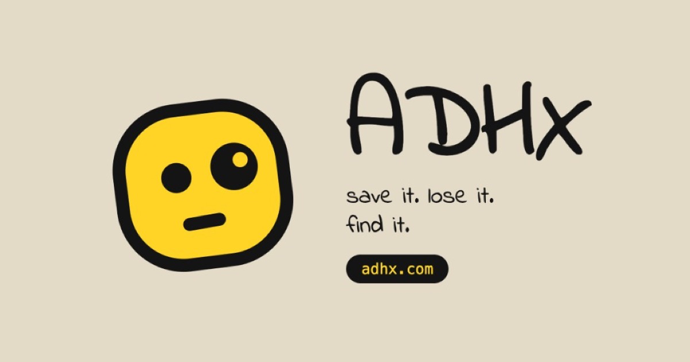

# ADHX

[](https://github.com/itsmemeworks/adhx/actions/workflows/ci.yml)
[](https://github.com/itsmemeworks/adhx/actions/workflows/release-please.yml)
[](https://opensource.org/licenses/MIT)
[](CONTRIBUTING.md)

> **Save it. Lose it. Find it.**

Stop saying "wait, I had the perfect meme for this." Save your favorites, build shareable playlists, and become the meme lord your group chat deserves.

Open an ADHX link and start watching. You do not need an account to view posts from **X, Instagram images and Reels, TikTok, or YouTube Shorts** in the full-screen theater. When something is worth keeping, sign in with an email magic link and save it.

ADHX is for the links you meant to come back to: one place to watch them, search them, tag them, archive them, or turn a tag into a public playlist. It is open source and self-hostable, with your saves stored in a SQLite file you own.

<p align="center">
  
</p>

> **Building, extending, or self-hosting ADHX?** Read the human-facing [architecture guide](ARCHITECTURE.md) for the routes, data flow, authentication, media handling, and security model.

## Why use ADHX?

Social links are easy to save and hard to revisit. ADHX turns them into a watchable queue instead of another forgotten list.

- **Watch before signing up.** Every supported link has a clean, shareable preview page with theater playback.
- **Save with email.** Sign-in uses an email magic link. An X account is not required.
- **Bring four platforms together.** X posts, photos, videos, quotes, and Articles sit beside Instagram image posts and Reels, TikToks, and YouTube Shorts.
- **Choose how you revisit things.** Watch your newest saves in **Saved**, browse and search them in the **library**, or group them into tagged **playlists**.
- **Keep control.** Run ADHX yourself and keep the SQLite database on your own machine or volume.

## From a link to something useful

Replace the source host with `adhx.com`, paste a link into ADHX, or use one of the save tools:

| Source          | Example preview route         | Playback                                       |
| --------------- | ----------------------------- | ---------------------------------------------- |
| X               | `/{user}/status/{id}`         | Text, photos, video, quotes, and full Articles |
| Instagram posts | `/p/{id}`                     | Full-resolution images and ordered carousels   |
| Instagram Reels | `/reels/{id}` or `/reel/{id}` | Inline Reel video with an official fallback    |
| TikTok          | `/@{user}/video/{id}`         | Inline video                                   |
| YouTube Shorts  | `/shorts/{id}`                | Official privacy-enhanced YouTube player       |

For example, `x.com/user/status/123` becomes `adhx.com/user/status/123`. You can also paste the full original URL after `adhx.com/`.

Preview pages are useful even if you never save anything: they are readable, linkable pages that keep viewing inside ADHX. Saving adds the post to your account and makes it available in Saved and the library.

## Saved, library, and playlists

These names describe different parts of ADHX:

- **Saved** is your pile of saves and the active watch queue at `/saved`. Newest saves play first.
- **The library** is the searchable, filterable grid over those saves at `/library`.
- **A playlist** is one tag you have made public. It plays as a looping theater at `/t/{username}/{tag}`.

Archive removes a post from your active Saved queue without deleting it. Archive is private: it never creates a public activity event or tells other people what you archived. Use **Show archived** in the library to find those posts again.

Tagging is private until you choose to publish a tag. A published tag becomes a playlist with:

- a shareable looping theater;
- a branded mosaic social card that previews the playlist when its URL is shared;
- a public curator profile;
- a **Save playlist** action that lets another signed-in person clone its posts and tag into their own account; and
- a place on the public [`/leaderboard`](https://adhx.com/leaderboard), where playlists are ranked by views and clones across today, this week, this month, or all time.

## Live and Trending

ADHX also turns anonymous community activity into ways to discover what people are watching:

- **Live** is the full-screen community theater. Signed-out visitors see it at `/`. Signed-in visits to `/` redirect to `/live`; `/live` is the signed-in Live route.
- **Trending** at [`/trending`](https://adhx.com/trending) is the public ranked view. It orders active posts by momentum rather than simply showing the newest one first, with filters for videos, photos, text, and Articles.

Public activity is anonymous. ADHX never exposes the user ID attached to an activity record, and private Archive actions do not enter the public pulse.

## Save from the device you already use

### On a phone

- **Paste a link:** Copy Link in X, Instagram, TikTok, or YouTube Shorts, open ADHX, and tap **Paste link**.
- **iPhone or iPad:** Install the [ADHX iOS Shortcut](https://www.icloud.com/shortcuts/0d187480099b4d34a745ec8750a4587b), then use **Share → ADHX** from the source app.
- **Android:** Install ADHX as a PWA with **Add to Home Screen**, then use **Share → ADHX**. Android apps put links in different share fields; ADHX accepts the common forms.

The URL-prefix trick remains available on every platform.

### On a desktop

The extension in [`extension/`](extension/) adds a toolbar action, a **Save to ADHX** context-menu item, and the `⌘⇧A` / `Ctrl+Shift+A` shortcut. It supports X, Instagram, TikTok, and YouTube Shorts links and opens the same ADHX preview flow as paste and mobile sharing.

The extension is not in the Chrome Web Store yet. See [`extension/README.md`](extension/README.md) for the unpacked-install walkthrough.

## Send a file or share a page

ADHX keeps these actions distinct:

- **Send** prepares the video or photo file and includes a short `via` link to the ADHX preview when the device supports file sharing. On desktop, it falls back to a download.
- **Share link** shares the stable ADHX preview URL instead of the media file.

YouTube Shorts use the official YouTube player, so ADHX does not download or send a Shorts video file.

## How it fits together

```text
X · Instagram posts and Reels · TikTok · YouTube Shorts
                    │
     URL prefix · paste · share · extension
                    ▼
        ADHX preview theater (no account)
                    │ email sign-in + Save
                    ▼
       Saved queue ───── library
            │               │
          Archive         tag + publish
          (private)          ▼
                     playlist theater
                      curator · clones
                         leaderboard
```

Underneath, ADHX is one Next.js 16 + React 19 app backed by SQLite and Drizzle. Email magic links create the account; optional X OAuth links an existing account for bookmark sync. Media uses platform-appropriate embeds or tightly limited proxy routes.

For the complete explanation, see **[ARCHITECTURE.md](ARCHITECTURE.md)**. Machine readers and agents can start with [`llms.txt`](https://adhx.com/llms.txt).

## Run it locally

No API keys are needed to try the core app. In development, email sign-in prints the magic link to the server console when Resend is not configured.

```bash
git clone https://github.com/itsmemeworks/adhx
cd adhx
pnpm install
cp .env.example .env
pnpm db:migrate
pnpm dev
```

Local development runs at [http://localhost:3001](http://localhost:3001). This is intentionally different from the Docker examples below, which expose port **3000**.

Open the local app, sign in with any email, copy the magic link from the terminal, and paste a supported post URL. Local setup needs `pnpm db:migrate` because Docker performs migration automatically at startup.

Set a distinct `SESSION_SECRET` before any real deployment. Generate one with:

```bash
openssl rand -base64 32
```

```bash
pnpm typecheck
pnpm test
pnpm lint
pnpm format:check
pnpm build
```

See [`.env.example`](.env.example) for all configuration and [CONTRIBUTING.md](CONTRIBUTING.md) for the development workflow. Coding agents should also read [AGENTS.md](AGENTS.md) and [CLAUDE.md](CLAUDE.md).

### Optional X bookmark sync

X is not used to sign in to ADHX. After email sign-in, you can optionally link X in Settings to sync your existing X bookmarks.

To enable sync locally:

1. Create an app in the [X Developer Portal](https://developer.twitter.com) and enable OAuth 2.0 with PKCE.
2. Register `http://localhost:3001/api/auth/twitter/callback`.
3. Set `TWITTER_CLIENT_ID`, `TWITTER_CLIENT_SECRET`, and `NEXT_PUBLIC_APP_URL=http://localhost:3001` in `.env`.

### Build the desktop extension locally

With the app already running at `http://localhost:3001`:

```bash
pnpm --dir extension install
cp extension/.env.example extension/.env
pnpm --dir extension build
```

Set `EXTENSION_PUBLIC_APP_ORIGIN=http://localhost:3001` in `extension/.env`, then load `extension/dist/chromium` from Chrome's `chrome://extensions` page with Developer mode enabled. Full instructions are in [`extension/README.md`](extension/README.md).

Browser sessions are origin-specific: signing in at `adhx.com` does not sign you in at `localhost:3001`.

## Self-hosting

Self-hosting keeps account data, saves, tags, and settings in your SQLite database. Mount `/data` on persistent storage and back up that volume like any other database.

### Docker

Every release publishes a public multi-platform image for AMD64 and ARM64 at
[`ghcr.io/itsmemeworks/adhx`](https://github.com/itsmemeworks/adhx/pkgs/container/adhx).
It runs database migrations automatically at startup and exposes ADHX on port 3000:

```bash
docker pull ghcr.io/itsmemeworks/adhx:latest
export RESEND_API_KEY=re_your_key
export EMAIL_FROM='ADHX <login@your-verified-domain.example>'
docker run -d -p 3000:3000 -v adhx_data:/data \
  -e DATABASE_PATH=/data/adhx.db \
  -e SESSION_SECRET=$(openssl rand -base64 32) \
  -e NEXT_PUBLIC_APP_URL=http://localhost:3000 \
  -e RESEND_API_KEY \
  -e EMAIL_FROM \
  ghcr.io/itsmemeworks/adhx:latest
```

For reproducible deployments, replace `latest` with a release tag such as `1.66.2`.
You can still build from source with `docker build -t adhx .`.

`RESEND_API_KEY` and a verified `EMAIL_FROM` sender are required for magic-link sign-in in
the production image. Add `TWITTER_CLIENT_ID` and `TWITTER_CLIENT_SECRET` to enable X sync,
with `<your-url>/api/auth/twitter/callback` registered in the X Developer Portal.
`DATABASE_PATH` defaults to `/data/adhx.db` in the image.

### Docker Compose

[`docker-compose.yml`](docker-compose.yml) pulls the GHCR image, publishes port 3000, and creates the persistent volume:

```bash
docker compose pull
docker compose up -d
```

Export `SESSION_SECRET`, `RESEND_API_KEY`, and `EMAIL_FROM` before starting Compose; it refuses
to start without them. Set `ADHX_IMAGE=ghcr.io/itsmemeworks/adhx:<version>` to pin Compose to
a release.

### Fly.io

A starter [`fly.toml`](fly.toml) is included:

```bash
fly apps create your-app
fly volumes create adhx_data --region lhr --size 1 --app your-app
fly secrets set --app your-app \
  SESSION_SECRET=$(openssl rand -base64 32) \
  NEXT_PUBLIC_APP_URL=https://your-app.fly.dev
fly deploy --app your-app
```

Add the optional X and Resend secrets in the same way. For deployment structure, database migration behavior, health checks, and production OAuth notes, follow [ARCHITECTURE.md](ARCHITECTURE.md) and [CLAUDE.md](CLAUDE.md).

## For agents and machine readers

[`https://adhx.com/llms.txt`](https://adhx.com/llms.txt) is the compact map of ADHX's public, machine-readable surfaces. The architecture guide explains where those surfaces get their data and which privacy boundaries they enforce.

### Agent skill

ADHX ships an [Agent Skill](https://agentskills.io) that turns an X, Twitter, or ADHX post link into clean structured data, including full X Article content. It works with skills-compatible tools such as Claude Code, Cursor, Gemini CLI, Codex, and Copilot.

```bash
# Claude Code
/plugin marketplace add itsmemeworks/adhx
/plugin install adhx

# Other skills-compatible agents
SKILLS_DIR="$HOME/.cursor/skills" # change this for your agent
mkdir -p "$SKILLS_DIR/adhx" && curl -sL \
  https://raw.githubusercontent.com/itsmemeworks/adhx/main/skills/adhx/SKILL.md \
  -o "$SKILLS_DIR/adhx/SKILL.md"
```

Skill source: [`skills/adhx/SKILL.md`](skills/adhx/SKILL.md)

## Contributing

Issues and pull requests are welcome. See [CONTRIBUTING.md](CONTRIBUTING.md) for setup, tests, formatting, and commit conventions.

- [Privacy](PRIVACY.md) — what the hosted service stores and what remains private
- [Security](SECURITY.md) — how to report vulnerabilities privately
- [Code of Conduct](CODE_OF_CONDUCT.md)

## License

ADHX is available under the [MIT License](LICENSE).
