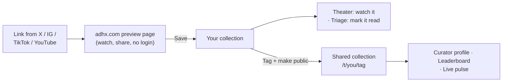

# ADHX

[](https://github.com/itsmemeworks/adhx/actions/workflows/ci.yml)
[](https://github.com/itsmemeworks/adhx/actions/workflows/release-please.yml)
[](https://opensource.org/licenses/MIT)
[](CONTRIBUTING.md)

> **Save now. Read never. Find always.**

ADHX turns the stuff you save from **X, Instagram, TikTok, and YouTube** into something you'll actually watch. Every saved post lands in one collection, plays in one full-screen **theater**, and can be tagged into **collections** you share as looping playlists — with public curator profiles and a community **leaderboard** on top. Open source (MIT), self-hostable, your data in a SQLite file you own.

<p align="center">
  
</p>

## What it does

- **Save from four platforms** — swap any link's host to `adhx.com` (`x.com/user/status/123` → `adhx.com/user/status/123`), use the share sheet / bookmarklet / iOS shortcut, or sync your X bookmarks in one click. On mobile: **Copy Link** in any share sheet → open ADHX → tap **Paste link**.
- **Every post gets a preview page** — clean, fast, shareable, and indexable, with inline playback. No login needed to view.
- **The theater** — one full-screen player for everything: the community **Live** pulse, **My Collection**, and any shared tag collection. Keyboard-driven, autoplaying, auto-advancing.
- **Triage** — flip through your unread backlog and mark posts read with one key. That's the whole feature.
- **Tagged collections** — tag posts, make a tag public, and it becomes a looping theater at `adhx.com/t/you/tag` with your curator profile at `adhx.com/t/you`.
- **Leaderboard** — public collections ranked by views and saves at [`/leaderboard`](https://adhx.com/leaderboard), by day / week / month / all-time.
- **Agent-friendly** — public JSON APIs, [`llms.txt`](https://adhx.com/llms.txt), and a portable [agent skill](#agent-skill) for reading X posts as structured data.

## How it works


```mermaid
flowchart LR
    A["Link from X / IG /<br/>TikTok / YouTube"] --> B["adhx.com preview page<br/>(watch, share, no login)"]
    B -->|Save| C["Your collection"]
    C --> D["Theater: watch it<br/>· Triage: mark it read"]
    C -->|Tag + make public| E["Shared collection<br/>/t/you/tag"]
    E --> F["Curator profile · Leaderboard<br/>· Live pulse"]
```

Next.js 16 + React 19, SQLite (Drizzle) on a single volume, X OAuth 2.0 PKCE and/or magic-link email accounts. Media plays via platform-official embeds or lightweight proxy mirrors — full details in [ARCHITECTURE.md](ARCHITECTURE.md).

## Run it locally

No API keys needed to try it — email sign-in prints the magic link to your terminal in dev:

```bash
git clone https://github.com/itsmemeworks/adhx
cd adhx
pnpm install
cp .env.example .env   # defaults work out of the box
pnpm dev
```

Open [http://localhost:3001](http://localhost:3001), sign in with any email, copy the magic link from the server console, and paste a post URL to save your first item.

**Optional — X bookmark sync** (needs a free [X developer app](https://developer.twitter.com)):

1. Create a project + app, enable OAuth 2.0 with PKCE.
2. Set the callback URL to `http://localhost:3001/api/auth/twitter/callback`.
3. Put the Client ID/Secret in `.env` (`TWITTER_CLIENT_ID`, `TWITTER_CLIENT_SECRET`) and set `NEXT_PUBLIC_APP_URL=http://localhost:3001`.

```bash
pnpm test        # full test suite
pnpm typecheck   # tsc
pnpm build       # production build
```

See [`.env.example`](.env.example) for every variable, [CONTRIBUTING.md](CONTRIBUTING.md) for the workflow, and [CLAUDE.md](CLAUDE.md) if you're pointing a coding agent at this repo.

## Self-hosting

The `Dockerfile` builds a standalone image that migrates its own database on startup:

```bash
docker build -t adhx .
docker run -d -p 3000:3000 -v adhx_data:/data \
  -e DATABASE_PATH=/data/adhx.db \
  -e SESSION_SECRET=$(openssl rand -base64 32) \
  -e NEXT_PUBLIC_APP_URL=http://localhost:3000 \
  adhx
```

Add `TWITTER_CLIENT_ID`/`TWITTER_CLIENT_SECRET` for X sync (callback: `<your-url>/api/auth/twitter/callback`) and `RESEND_API_KEY` for real magic-link emails. `DATABASE_PATH` defaults to `/data/adhx.db` inside the image, so the bare command above works without setting it — the `-v` flag is what makes the SQLite file persist across container restarts.

Prefer one command? `docker-compose.yml` builds the image and wires up the same volume:

```bash
docker compose up --build
```

A ready-to-use Fly.io config ships in `fly.toml`:

```bash
fly apps create your-app && fly volumes create adhx_data --region lhr --size 1
fly secrets set SESSION_SECRET=$(openssl rand -base64 32) NEXT_PUBLIC_APP_URL=https://your-app.fly.dev
fly deploy
```

## Public API

No auth, rate-limited, stable:

| Endpoint                                 | Returns                                                              |
| ---------------------------------------- | -------------------------------------------------------------------- |
| `GET /api/share/tweet/{username}/{id}`   | Any X post as clean JSON — full long-form Articles included          |
| `GET /api/trending`                      | The anonymous community pulse (recent saves/previews)                |
| `GET /api/collections/trending?window=`  | The collection leaderboard (`today` / `week` / `month` / `all-time`) |
| [`/llms.txt`](https://adhx.com/llms.txt) | Machine-readable index of everything above                           |

## Agent skill

ADHX ships an [Agent Skill](https://agentskills.io) — paste any X link into a skills-compatible agent (Claude Code, Claude, Cursor, Gemini CLI, Codex, Copilot, and more) and it reads the post as structured JSON via the API above. No browser, no scraping, Articles included.

```bash
# Claude Code
/plugin marketplace add itsmemeworks/adhx
/plugin install adhx

# Any other agent: drop the skill file into its skills directory
mkdir -p <SKILLS_DIR>/adhx && curl -sL \
  https://raw.githubusercontent.com/itsmemeworks/adhx/main/skills/adhx/SKILL.md \
  -o <SKILLS_DIR>/adhx/SKILL.md
```

Skill source: [`skills/adhx/SKILL.md`](skills/adhx/SKILL.md)

## Contributing

Issues and PRs welcome — see [CONTRIBUTING.md](CONTRIBUTING.md). Conventional commits, tests required, releases automated via Release Please. Security reports: see [SECURITY](CONTRIBUTING.md) notes or open a private advisory.

## License

[MIT](LICENSE)
